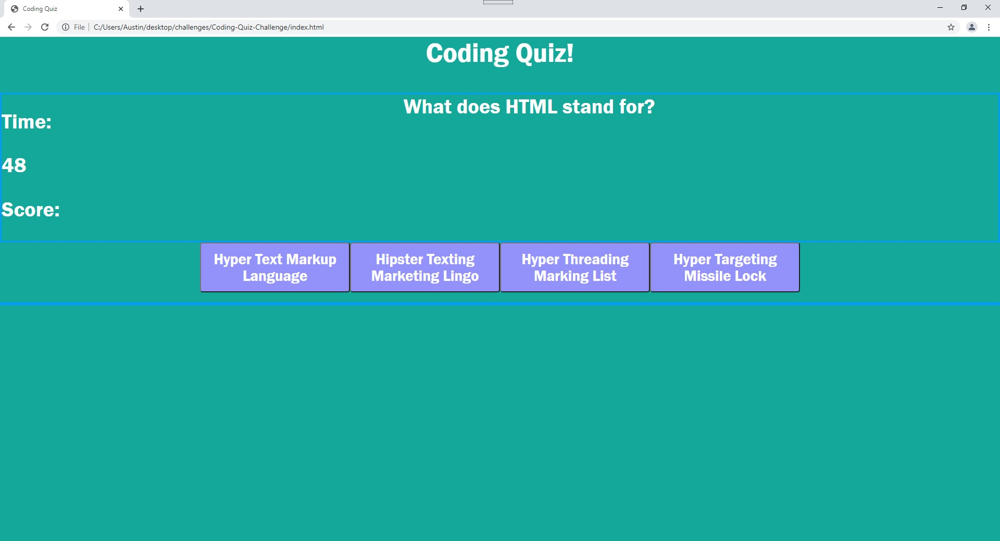

# Coding-Quiz-Challenge

Hitting the start button will start the quiz. You will have 60 seconds to answer all 5 questions. When 30 seconds are remaining the clock numbers will turn red to let you know.
I styled the correct and incorrect feedback as well.

When I tried to write the questions and answers as we were taught during the seminars all I kept getting no matter what I did was the questions and buttons displaying [Object object].

I am throwing in the towel on the rest of this as I am dealing with a family medical emergency and I do not have any more time, or mental strength, to try and implement everything required.

